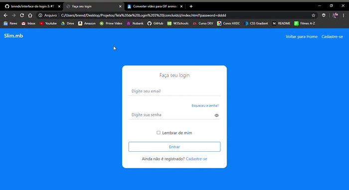

<h1 align="center">
  Faça seu login (agora com Bootstrap! uhul o/)
</h1>

### Este é o meu sétimo projeto desenvolvido com o objetivo de colocar em prática os conhecimentos obtidos durante o aprendizado de Desenvolvimento Web. E através dos repositórios está sendo possível acompanhar uma timeline da minha evolução.

________
 
### 📚 Tecnologias utilizadas:
* Bootstrap
* JQuery
* CSS
* HTML

### ✨ Sobre o projeto e o que eu aprendi:
O projeto é um layout de uma tela de login com e-mail, senha, esqueci a senha e cadastre-se.

 *Para este projeto eu aprendi como estilizar formulários com bootstrap, criar uma navbar simples e mostrar a senha que está sendo digitada ao passar o mouse no ícone do olho.*

### 📷 GIF do site:

________

<h4 align="center">
  Feito com ❤ by Brenda Miranda
</h4>
