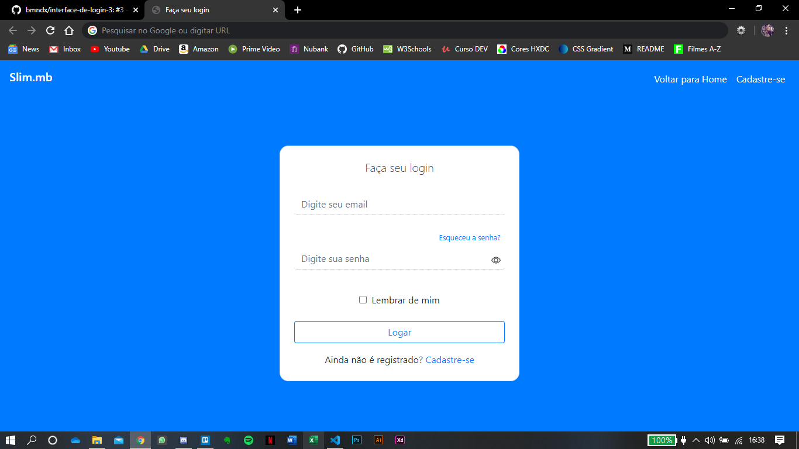

<h1 align="center">
  Faça seu login (agora com Bootstrap! uhul o/)
</h1>

### Este é o meu sétimo projeto desenvolvido com o objetivo de colocar em prática os conhecimentos obtidos durante o aprendizado de Desenvolvimento Web. E através dos repositórios está sendo possível acompanhar uma timeline da minha evolução.

________
 
### 💻 Tecnologias utilizadas:
* Bootstrap
* JQuery
* CSS
* HTML

### ✨ Sobre o projeto:
Layout de uma tela de login com e-mail, senha, esqueci a senha, mostrar senha ao passar o mouse no ícone e cadastre-se.

## Screenshot do site:

________

<h1 align="center">
  Feito com ❤ by Brenda Miranda
</h1>
